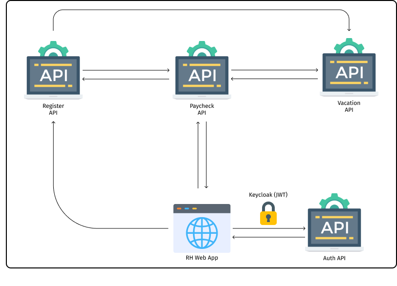

# Architectural Representation

The following image architecturally represents how the components are arranged
within the HR system.

[^1]

This is the list of system components existing in the solution which have their
documentation described in this documentation:

- [Auth API](../modules/api-auth.md)
- [Paycheck API](../modules/api-paycheck.md)
- [Register API](../modules/api-register.md)
- [Vacation API](../modules/api-vacation.md)
- [HR UI](../modules/front-register.md)

If you'd like to see the each API interfaces, go to:

- [Interface - Auth API](../interfaces/api-auth.md)
- [Interface - Paycheck API](../interfaces/api-paycheck.md)
- [Interface - Register API](../interfaces/api-register.md)
- [Interface - Vacation API](../interfaces/api-vacation.md)

[^1]: HR Software Architectural Diagram (SOURCE: João Pedro Sconetto)
